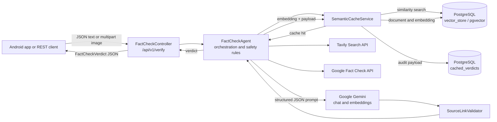
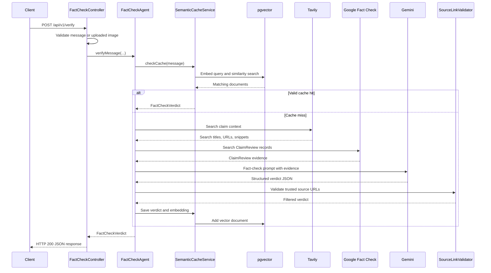
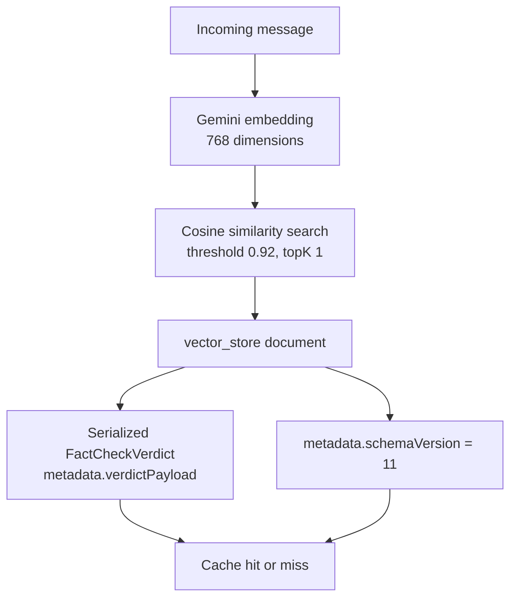
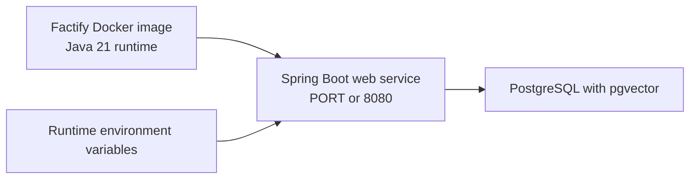

# Factify Backend Architecture

Factify is a Spring Boot 4.1.0 backend running on Java 21. It accepts text and image-based fact-check requests, gathers external evidence, asks Gemini to produce a structured verdict, validates the returned source links, and stores text verdicts in a semantic cache backed by PostgreSQL and pgvector.

## System Overview



## Request Flow



## Main Modules

| Module | Responsibility |
|---|---|
| `FactifyBackendApplication` | Spring Boot application entry point. |
| `FactCheckController` | REST endpoints, JSON/multipart validation, HTTP responses, and request logging. |
| `FactCheckAgent` | Coordinates cache lookup, external evidence, Gemini generation, source validation, response normalization, and safety checks. |
| `SemanticCacheService` | Performs vector similarity lookup and stores embeddings plus serialized verdict payloads. |
| `TavilySearchService` | Retrieves current web-search context for claim disambiguation. |
| `GoogleFactCheckService` | Queries Google ClaimReview records, extracts publishers, ratings, titles, and URLs, and filters unrelated results. |
| `SourceLinkValidator` | Checks returned source URLs and removes unreachable links. |
| `CachedVerdictRepository` | Spring Data JPA access to the `cached_verdicts` audit table. |
| `FactCheckVerdict` and `ClaimAnalysis` | Immutable response models returned to the frontend. |

## REST API

Base path:

```text
/api/v1/verify
```

### JSON text request

```http
POST /api/v1/verify
Content-Type: application/json
```

```json
{
  "message": "The claim to verify"
}
```

### Multipart request

```http
POST /api/v1/verify
Content-Type: multipart/form-data
```

Parts:

- `message`: optional text claim.
- `files`: optional image attachments.

The controller converts image files into Spring AI `Media` objects so Gemini can inspect visible claims in the image.

## Semantic Cache Design

The cache uses Spring AI's `VectorStore` abstraction backed by PostgreSQL pgvector.



Each vector document contains:

- Original message text used for embedding.
- `cacheKind = fact-check-verdict`.
- `schemaVersion = 11`.
- Serialized `FactCheckVerdict` in `verdictPayload`.

The relational `cached_verdicts` table is an audit store. Semantic lookup happens in `vector_store`, not in `cached_verdicts`.

## Database Tables

### `vector_store`

Managed by Spring AI's pgvector store. It contains the embedded document text, JSON metadata, and a `vector(768)` embedding.

### `cached_verdicts`

Managed by JPA/Hibernate. It stores:

- Original input text.
- JSON metadata.
- Serialized verdict payload.
- Creation and update timestamps.

## External Services

| Service | Use |
|---|---|
| Google Gemini | Generates structured fact-check verdicts and text embeddings. |
| Google Fact Check Tools API | Finds published ClaimReview records and professional fact-check URLs. |
| Tavily Search API | Provides web-search context and query candidates. |
| PostgreSQL + pgvector | Stores embeddings, performs similarity search, and stores audit records. |

All API keys and database credentials should be injected through environment variables. They should not be committed to `application.yml`, Docker files, or example files containing real values.

## Deployment



For Docker Compose, the backend connects to the database service using the Compose hostname `postgres`. For Render or another hosted platform, configure `SPRING_DATASOURCE_URL`, `SPRING_DATASOURCE_USERNAME`, and `SPRING_DATASOURCE_PASSWORD` with the provider's internal database connection details.

## Configuration Checklist

- `SPRING_AI_GOOGLE_GENAI_API_KEY` is valid for Gemini chat and embeddings.
- `GOOGLE_FACT_CHECK_API_KEY` is configured when Google ClaimReview lookup is enabled.
- `SPRING_DATASOURCE_URL` points to the actual PostgreSQL host, never `localhost` in a hosted container.
- PostgreSQL has the `vector` extension enabled.
- The vector column dimension matches the configured embedding dimension: `768`.
- `SPRING_SQL_INIT_MODE` is `never` when the deployment database manages schema separately.
- The pgvector table is initialized once before semantic cache requests are sent.
